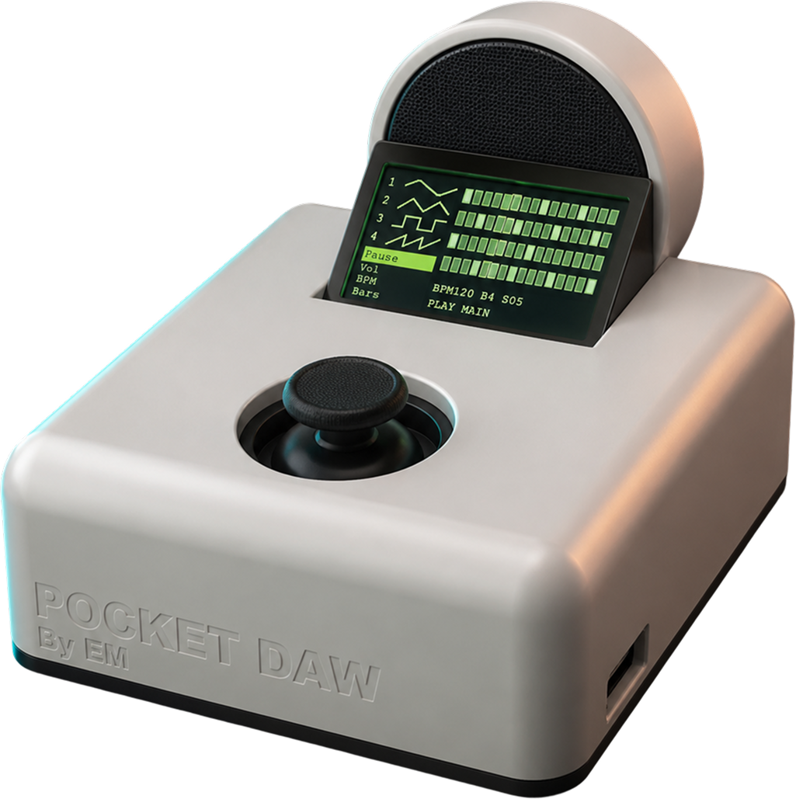
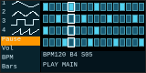
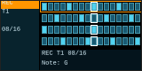
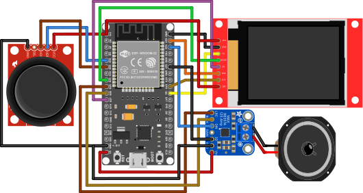

# Pocket DAW

Pocket DAW 是一台以 ESP32 WROVER 製作的可攜式硬體音序器與迷你數位音樂工作站。它把四軌 step sequencer、即時搖桿錄音、TFT 操作介面與 I2S 音訊輸出整合在同一個手持裝置中，讓使用者不需要接上電腦，也能快速建立 loop、切換音色、調整速度並進行即興演奏。

這個專案的重點不只是把功能塞進開發板，而是把「可以被演奏的介面」做成完整作品：ESP32 負責即時音訊與 UI 狀態更新，搖桿承擔導覽與音符輸入，外殼則透過 Fusion 360 建模與 3D 列印，讓螢幕、控制器、喇叭輸出與握持角度形成一致的操作體驗。

<p align="center">
  
</p>

## 專案亮點

- 四軌 step sequencer，每軌可獨立設定靜音、音量、音色與 pattern。
- 最長 32 steps，支援 1 到 8 小節 loop 長度，適合快速建立節奏與旋律片段。
- 以 2-axis analog joystick 操作所有選單，也能在錄音模式中輸入八方向音符。
- 內建 Sine、Triangle、Square、Saw 與 Drum voice，透過 MAX98357A 進行 I2S 音訊輸出。
- ST7735S TFT 顯示目前軌道、播放游標、step grid、BPM、Bars 與錄音狀態。
- 音訊、輸入與 UI 分成獨立 FreeRTOS tasks，音訊路徑使用固定 buffer，避免即時播放被畫面更新干擾。

## 畫面預覽

| 主畫面播放中 | 即時錄音中 |
| --- | --- |
|  |  |

主畫面左側顯示四條軌道與主要功能，右側是 4 軌 step grid。亮色格代表該 step 有音符，白色框代表目前播放位置。錄音時，畫面會切換為 REC 狀態，只要在目前 step 期間推到搖桿方向，系統就會把該方向鎖存並寫入目前選取的軌道。

## 硬體規格

| 類別 | 規格 |
| --- | --- |
| 控制核心 | ESP32 WROVER Module |
| Arduino FQBN | `esp32:esp32:esp32wrover` |
| 顯示 | ST7735S 80 x 160 TFT |
| 音訊輸出 | MAX98357A I2S DAC / Class-D amplifier |
| 輸入 | 2-axis analog joystick with switch |
| 音訊取樣率 | 22.05 kHz |
| 軌道數 | 4 tracks |
| Pattern 長度 | 1-8 bars, 4 steps per bar, 32 steps max |

## 硬體連接

<p align="center">
  
</p>

| 功能 | ESP32 pin |
| --- | --- |
| TFT CS | GPIO 5 |
| TFT DC | GPIO 27 |
| TFT RST | GPIO 33 |
| TFT MOSI | GPIO 23 |
| TFT SCLK | GPIO 18 |
| I2S BCLK | GPIO 26 |
| I2S LRC / WS | GPIO 25 |
| I2S DOUT | GPIO 22 |
| I2S SD | GPIO 21 |
| Joystick X | GPIO 34 |
| Joystick Y | GPIO 35 |
| Joystick SW | GPIO 32 |

## 操作方式

Pocket DAW 只使用搖桿完成導覽、確認、數值調整與錄音輸入。

| 搖桿動作 | 一般操作 |
| --- | --- |
| 上 / 下 | 移動選單游標，或增加 / 減少目前參數 |
| 右 | 進入選單、確認項目、切換播放 |
| 左 | 返回上一層，或離開參數調整畫面 |
| 按下 | 作為硬體按鍵輸入保留 |

錄音模式中，搖桿方向不再控制選單，而是映射成音符。整個 step 都沒有推到方向時，該格會錄成空拍。

| 搖桿方向 | 音符 |
| --- | --- |
| 左 | C |
| 上 | D |
| 右上 | E |
| 右 | F |
| 右下 | G |
| 下 | A |
| 左下 | B |
| 左上 | C+ |
| 整格無方向 | 空拍 |

如果目前軌道選擇 `Drum`，同一組方向會映射成 drum 聲音：左 / 右下是 Kick，上 / 下是 Snare，右上 / 左下是 Hat，右 / 左上是 Tom。

## 主畫面與選單

主畫面左側顯示 4 條軌道與主要控制項：

- `1` + sine 波形圖示
- `2` + triangle 波形圖示
- `3` + square 波形圖示
- `4` + saw 波形圖示
- `Play` / `Pause`
- `Vol`
- `BPM`
- `Bars`

選擇第 1 到第 4 軌後向右，可進入該軌道的設定選單。

| 項目 | 功能 |
| --- | --- |
| `Mute` / `Unmut` | 靜音或取消靜音目前軌道 |
| `Record` | 進入錄音待命 |
| `Vol` | 調整目前軌道音量 |
| `OSC` | 選擇目前軌道的 oscillator |

全域參數包含：

- `M Vol`：master volume，影響整體輸出音量。
- `TnVol`：單一軌道音量，只影響目前選取的軌道。
- `BPM`：sequencer 速度，每個 step 的時間是 `30000 / BPM` ms。
- `Bars`：loop 小節數，範圍是 1 到 8；每小節 4 step。

## Oscillator

每條軌道可以選擇一種 oscillator。

| 顯示 | 聲音 |
| --- | --- |
| Sine 圖示 | Sine |
| Triangle 圖示 | Triangle |
| Square 圖示 | Square |
| Saw 圖示 | Saw |
| `Drum` | Kick、Snare、Hat、Tom |

## 錄音流程

1. 在主畫面選擇想錄音的軌道。
2. 向右進入軌道選單。
3. 選擇 `Record` 並向右確認。
4. 畫面進入 `ARM`，系統等待 loop 回到 step 1。
5. 進入 `REC` 後，每個 step 期間只要推到搖桿方向就會鎖存該音符，切到下一格時寫入剛結束的 step。
6. 錄完整個 loop 後，自動回到軌道選單。

這個流程讓錄音起點固定在 loop 第一拍，避免每次按下錄音時因時機不同造成 pattern 位移。

## 快速開始

1. 確認 ST7735S、MAX98357A、搖桿與 ESP32 WROVER 已依照接線表連接。
2. 接上 USB，確認序列埠出現，例如 `/dev/cu.usbserial-0001`。
3. 編譯並上傳：

```sh
"/Applications/Arduino IDE.app/Contents/Resources/app/lib/backend/resources/arduino-cli" compile --upload --fqbn esp32:esp32:esp32wrover --port /dev/cu.usbserial-0001 .
```

上傳完成後，ESP32 會自動 reset 並進入主畫面。如果上傳卡在 `Connecting...`，按住板子上的 `BOOT` 鍵直到開始寫入 flash。

## 編譯與上傳

如果 `arduino-cli` 已經在 `PATH` 裡：

```sh
arduino-cli compile --fqbn esp32:esp32:esp32wrover .
```

這台 Mac 也可以直接使用 Arduino IDE 內建 CLI：

```sh
"/Applications/Arduino IDE.app/Contents/Resources/app/lib/backend/resources/arduino-cli" compile --fqbn esp32:esp32:esp32wrover .
```

列出目前連接的板子：

```sh
arduino-cli board list
```

上傳到 ESP32 WROVER：

```sh
arduino-cli compile --upload --fqbn esp32:esp32:esp32wrover --port /dev/cu.usbserial-0001 .
```

## 搖桿校正

目前搖桿原始 ADC 範圍設定在 `Config.h`：

```cpp
#define JOY_ADC_MIN 0
#define JOY_ADC_MAX 4095
#define JOY_NORM_SCALE 1000
#define JOY_NAV_DEAD 450
#define JOY_RECORD_DEAD 450
```

開機時會自動讀取搖桿當下的靜止位置作為中心點。執行時會把 ADC 數值限制在 `0..4095`，再轉成 `-1000..1000`，讓 dead zone 更容易調整。

如果搖桿太容易誤觸，優先調高：

- `JOY_NAV_DEAD`
- `JOY_RECORD_DEAD`

如果搖桿太不靈敏，則調低這兩個值。若某個方向完全無法觸發，應先檢查搖桿接線與供電，再調整軟體參數。

## 軟體架構

程式依功能拆成固定模組，避免把輸入、音訊、狀態與顯示邏輯混在同一個檔案。

| 檔案 | 說明 |
| --- | --- |
| `esp32-daw.ino` | Arduino 入口、初始化順序、FreeRTOS task 建立 |
| `Config.h` | pin、畫面尺寸、音訊參數、搖桿設定 |
| `Types.h` | enum 與固定大小 struct |
| `State.h/.cpp` | 共享狀態、dirty flags、初始化 pattern |
| `Joystick.h/.cpp` | ADC 校正、濾波、dead zone、方向判斷 |
| `AudioEngine.h/.cpp` | I2S、oscillator、envelope、mixing、audio task |
| `Sequencer.h/.cpp` | step 推進、錄音寫入、voice trigger |
| `DisplayUI.h/.cpp` | TFT 繪圖與 dirty UI 更新 |
| `InputController.h/.cpp` | 搖桿事件、debounce、選單狀態機 |

## 即時音訊設計

音訊路徑維持固定且可預期：

- 使用固定大小陣列與固定大小 audio buffer。
- 不在 runtime path 使用 `new`、`malloc`、`free`、STL containers 或 Arduino `String`。
- audio path 不使用 virtual function。
- critical section 只做短時間共享狀態讀寫，渲染前先複製必要資料。
- audio task pinned to core 1，priority 高於 input / UI task。
- UI 使用 dirty flags，只更新需要重繪的區域，避免頻繁全畫面刷新。

## 畫面顏色

如果實機 ST7735S 出現橘色顯示成藍色、亮藍色顯示成土黃色，代表 TFT 的 RGB / BGR 色序需要在 firmware 裡修正。海報用 SVG 保持預期 UI 顏色，不需要用紅藍交換補償。

## 海報與 UI 素材

海報與 UI 素材位於 `poster/`：

- `poster/report.html`：A2 海報版面。
- `poster/report.css`：海報樣式。
- `poster/image.png`：產品外觀圖。
- `poster/circuit.svg`：硬體接線圖。
- `poster/ui-svg/`：TFT UI 狀態圖。

重新產生 UI SVG：

```sh
python3 tools/generate_ui_svgs.py
```

SVG 使用 `viewBox="0 24 160 80"` 對齊 Arduino 程式中的 TFT 可見區域，並使用內縮像素線模擬 `Adafruit_GFX::drawRect()`，避免右側邊框在設計軟體中被裁切。
